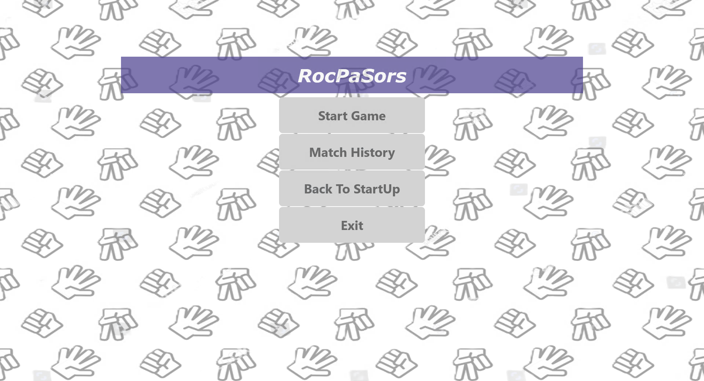
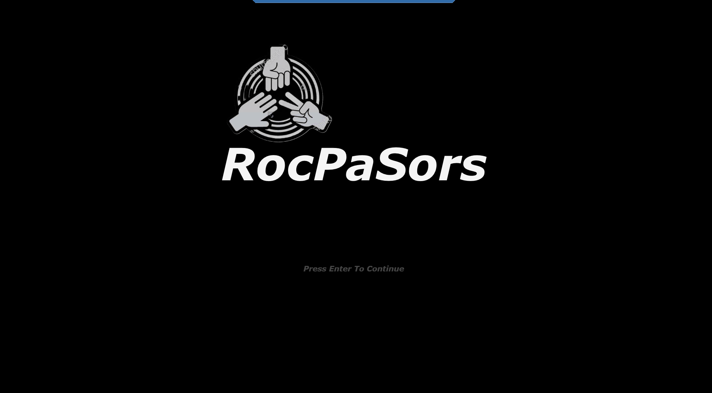
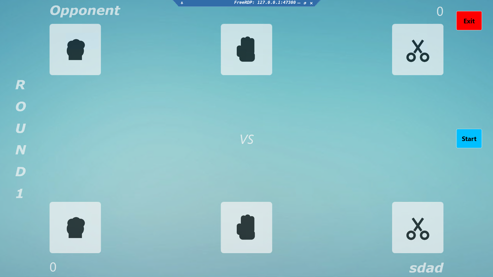
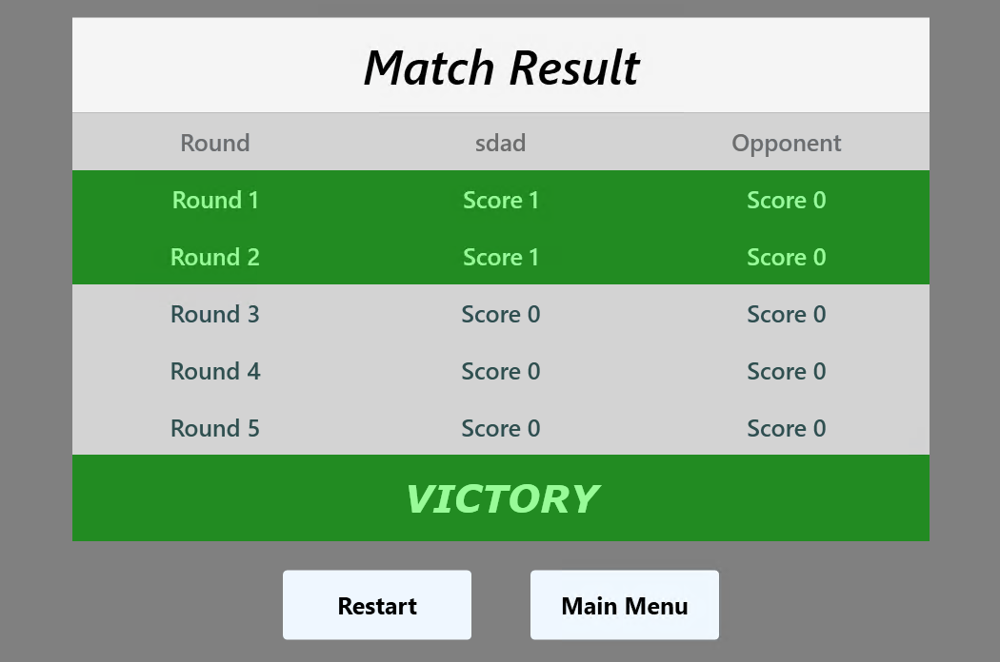
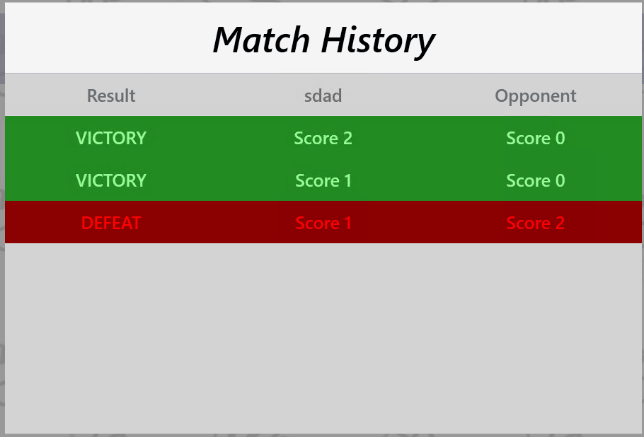

# RocPaSors

## Overview

RocPaSors is a polished Windows desktop game built with WPF and .NET 6. It implements a classic suit game where the player competes against a bot in a best-of-five match. Each round resolves into one of three outcomes: win, lose, or tie. After the fifth round, the match result is recorded in the local match history.

The game is designed for fast play, clear UI feedback, and reliable history tracking.

## Gameplay

- Player vs. bot suit match
- Three possible outcomes per round: **Win**, **Lose**, **Tie**
- Fixed duration: **5 rounds per match**
- Completed matches are stored in **MatchHistory**

## Screenshots

### Main Menu



### Match Start



### Gameplay



### Match Result



### Match History



## Install Guide

### Installer Distribution

The recommended distribution method is via the built installer package. A sample installer script is included at `RocPaSors_Setup.iss`.

1. Build the game and publish the runtime output:

```powershell
cd RocPaSors

dotnet publish -c Release -r win-x64 --self-contained -o publish/win-x64
```

2. Open `RocPaSors_Setup.iss` in Inno Setup Compiler.
3. Compile the script to generate `Installers\RocPaSors_Setup.exe`.
4. Run the installer and choose the installation location when prompted.

### Direct App Deployment

If you do not want an installer, deploy the published folder directly:

1. Publish to a local folder:

```powershell
cd RocPaSors

dotnet publish -c Release -r win-x64 --self-contained -o publish/win-x64
```

2. Copy `publish\win-x64` to the target machine.
3. Launch `RocPaSors.exe` from the published folder.

> The `publish\win-x64` folder is the final deployment artifact. Do not use the temporary `bin\Release` output for distribution.

## Configuration

### Asset and Runtime Inclusion

The project is configured to include all asset files under `Assets\Images` and `Assets\Sounds` in both build output and publish output. This ensures that UI assets, sound effects, and icon assets are available in the deployed package.

### Installer Behavior

The installer script is configured to:

- Install into a chosen directory under `Program Files` by default
- Create Start Menu shortcuts
- Create a desktop shortcut
- Launch the game at the end of installation

To preserve installer location selection, the script uses `DisableDirPage=no`.

## Run From Source

### Running outside Visual Studio

To run the source code without Visual Studio, use the .NET CLI from the repository root.

```powershell
cd RocPaSors

dotnet restore

dotnet build -c Release

dotnet run --project RocPaSors.csproj --configuration Release
```

For a standalone published executable:

```powershell
dotnet publish -c Release -r win-x64 --self-contained -o publish/win-x64

publish\win-x64\RocPaSors.exe
```

### Running in VS Code

In Visual Studio Code, install the C# extension and open the workspace at the repository root.

- Use the VS Code debugger with the project `RocPaSors.csproj`
- Or run the .NET CLI commands in the integrated terminal

A sample launch configuration is recommended but not required if you prefer terminal-based execution.

## Project Structure

- `RocPaSors.csproj` — WPF application project file
- `Assets/Images` — UI images and icon assets
- `Assets/Sounds` — sound effect assets
- `tampilan_game` — screenshot assets for documentation
- `RocPaSors_Setup.iss` — Inno Setup installer script

## Notes for Developers

- The game is built on `.NET 6.0` targeting `net6.0-windows` with WPF
- Publishing as self-contained ensures the game can run on machines without .NET installed
- Use `publish\win-x64` as the deployment directory for release builds

## About RocPaSors

RocPaSors is a simple but complete suit game experience. It is designed for rapid local play, easy installer distribution, and consistent match history tracking for each completed session.

The architecture separates UI, game logic, and history storage so the core game remains maintainable and ready for future improvements.
